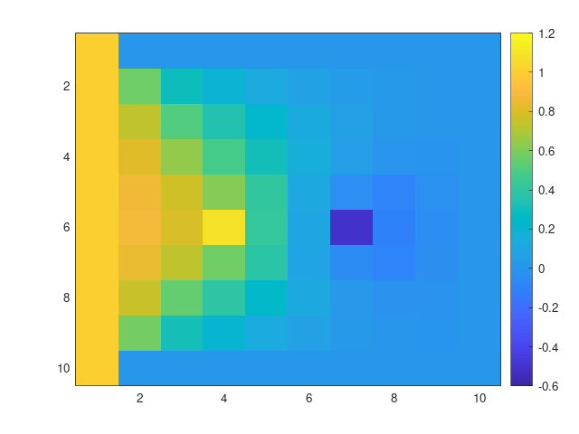

# pde-solver

----

{:.no_toc}

- TOC
{:toc}

----

## Description
This package implements a numerical solution for the heat equation in the form $`f = h`$, where $`f = \nabla^2u`$ and $`h = \frac{\partial u}{\partial t}`$.  

## Badges
On some READMEs, you may see small images that convey metadata, such as whether or not all the tests are passing for the project. You can use Shields to add some to your README. Many services also have instructions for adding a badge.

## Visuals
 "10x10 matrix, left heated border, one heat source and one sink, equispaced"

## Installation
1. open the terminal and navigate to your preferred working folder
2. clone the project using `git clone git@gitlab.lrz.de:advprog2022/22/pde-solver.git`
2. enter the project folder with `cd pde-solver`
2. *temporarily* switch to `dev` branch through `git checkout dev`
3. create a build directory and go inside it with `mkdir build && cd build`
4. call cmake using `cmake ../pde-solver` (it is fundamental to use cmake and it can be slow because it downloads the plotting library)
5. call `make`
6. execute the program in the terminal with `./pde-solver` and follow the instructions on screen

## Usage
The instructions that produced the image in [Visuals](#visuals) are, for example:

## Support
If you have any issue, [contact us](mailto:ge83bug(at)tum.de).

## Roadmap
The next steps in the development of these project are:
- First phase
	- output the steady-state values of each node in a result file :heavy_check_mark:
	- write unit tests
- Second phase 
	- refactor in a object oriented way
	- add different coordinate systems support
	- add relaxation schemes
	- add boundary conditions
- Third phase
	- analyze performance
	- improve performance

## Contributing
TODO

## Authors and acknowledgment
Authors: Matilde Tozzi (ge83bug(at)tum.de), Celia Tundidor Centeno (ge87loj(at)mytum.de)

## License
TODO

## Project status
Actively developed.
