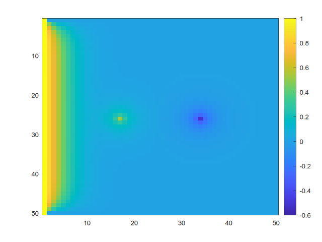

# pde-solver

----

[[_TOC_]]

----

## Description
This package implements a numerical solution for the heat equation in the form $`f = h`$, where $`f = \nabla^2u`$ and $`h = \frac{\partial u}{\partial t}`$.  

## Visuals

## Prerequisites
The graphical representation relies on `gnuplot`, which can be installed through the main Linux package managers, like `apt` etc

## Installation
1. open the terminal and navigate to your preferred working folder
2. clone the project using `git clone git@gitlab.lrz.de:advprog2022/22/pde-solver.git`
2. enter the project folder with `cd pde-solver`
2. *temporarily* switch to `dev` branch through `git checkout dev`
3. create a build directory and go inside it with `mkdir build && cd build`
4. call cmake using `cmake ../pde-solver` (it is fundamental to use cmake and it can be slow because it downloads the plotting library)
5. call `make`
6. execute the program in the terminal with `./pde-solver` and follow the instructions on screen

:exclamation:**NEW** the program can now be used with custom matrices in `.csv` format (N.B. only files with comma delimiters are supported at the moment). In this case, execute the program with `./pde-solver <path to f.csv> <path to h.csv>`

## Usage
The instructions that produced the image in [Visuals](#visuals) are, for example:

## Support
If you have any issue, [contact us](mailto:ge83bug(at)tum.de).

## Roadmap
The next steps in the development of these project are:
- First phase
	- output the steady-state values of each node in a result file :heavy_check_mark:
	- write unit tests :heavy_check_mark:
- Second phase 
	- refactor in a object oriented way :heavy_check_mark:
	- add relaxation schemes :heavy_check_mark:
	- add boundary conditions :heavy_check_mark:
- Third phase
	- add support for user-provided input matrices :heavy_check_mark:
	- analyze performance :heavy_check_mark:
	- improve performance :heavy_check_mark:

## Contributing
- Fork the project
- You can modify the following modules:
  - the **solver**, which is defined in `solver.h` and implemented in the `solver.cpp`
  - the **input matrices** , which are constructed through the `matrix` class, defined in `matrixutils.h` and implemented in the `matrixutils.cpp` 
  - the **user interface**, defined in `ioutils.h` and implemented in `ioutils.cpp`, so that your changes are easily usable by the end user
- Once you're done, open a pull request with us on GitLab

## Authors and acknowledgment
Authors: Matilde Tozzi (ge83bug(at)tum.de), Celia Tundidor Centeno (ge87loj(at)mytum.de)

## License
MIT

## Project status
Actively developed.
